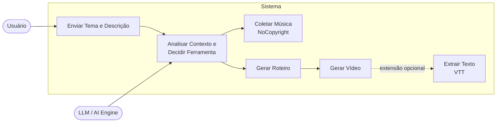

Diagrama de Casos de Uso,
Baseado na ideia inicial do projeto, onde o sistema recebe um tema e descrição, utiliza um LLM para decidir qual ferramenta usar, e executa a ferramenta correspondente.

Diagrama,

Este diagrama representa os casos de uso principais, mostrando as interações entre o usuário e o sistema, incluindo as decisões e execuções das ferramentas.