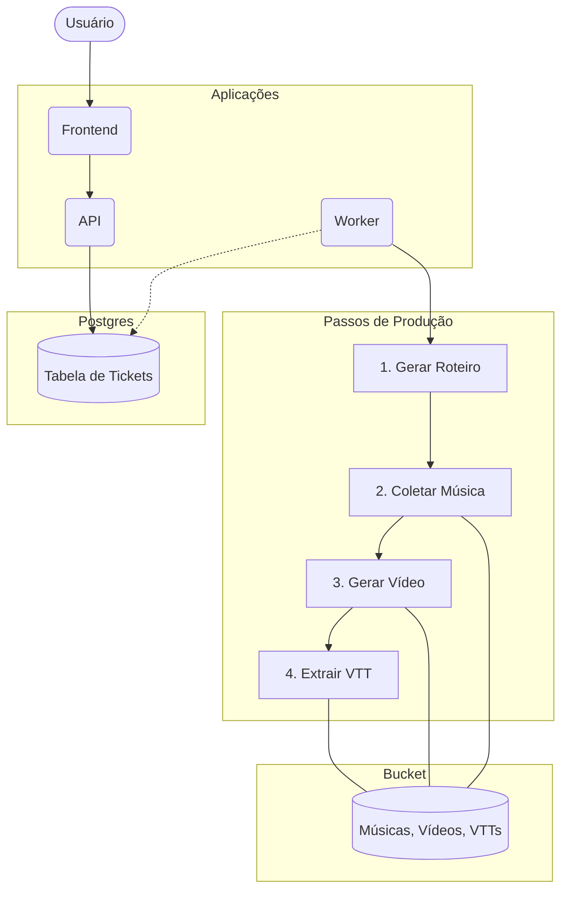
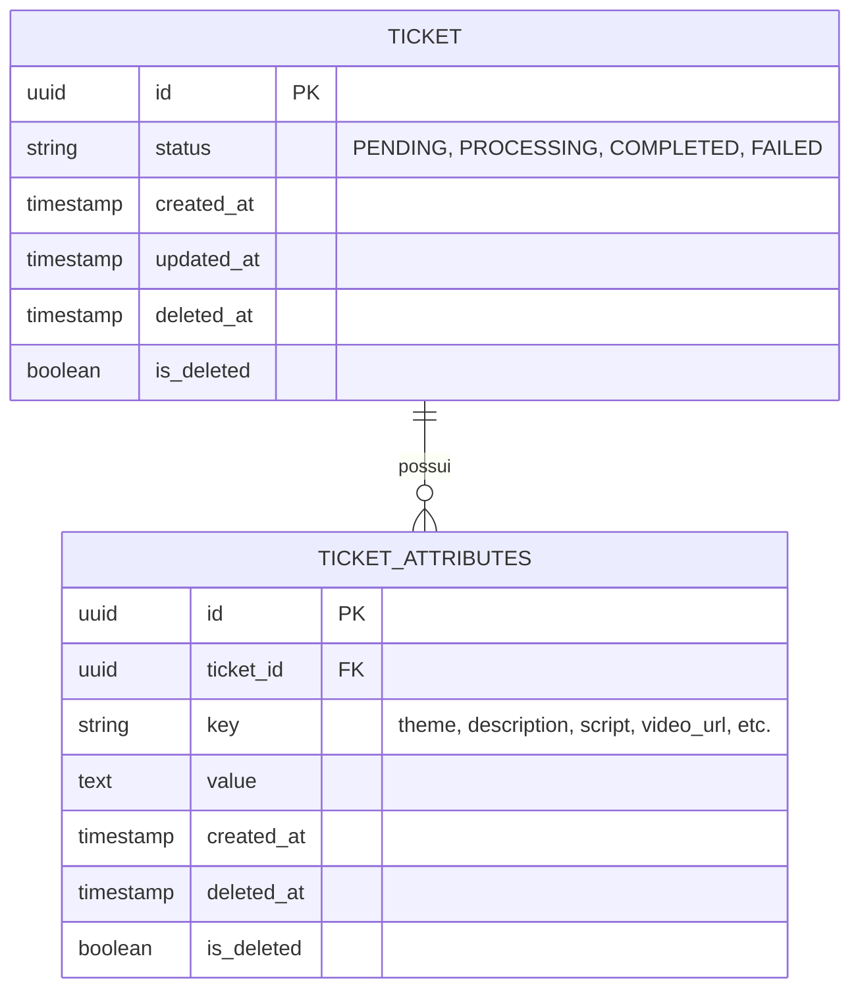

# Shortsmaker - Documentação do Sistema

O sistema é responsável por automatizar a criação de vídeos curtos (shorts) a partir de um tema e descrição fornecidos pelo usuário.

## 1. Arquitetura e Fluxo do Sistema

Este diagrama descreve as aplicações, serviços e o fluxo assíncrono de processamento.

## 2. Diagrama Entidade-Relacionamento (ER) - Normalizado (3NF)

O modelo foi normalizado para separar o ciclo de vida e auditoria do `Ticket` de seus dados dinâmicos e metadados.

### Detalhes do Funcionamento:
1. **Frontend:** Coleta os dados do usuário.
2. **API:** Recebe a requisição, gera um UUID para o **Ticket**, registra o status inicial e salva os inputs na tabela **TICKET_ATTRIBUTES**.
3. **Worker:** Atua de forma assíncrona. Ele busca no banco por tickets com status de processamento pendente, consulta os atributos necessários em **TICKET_ATTRIBUTES**, executa as ferramentas de IA e edição de vídeo, e persiste os arquivos no **Bucket**. A cada etapa, ele atualiza o status do **Ticket** e insere/atualiza os caminhos dos arquivos em **TICKET_ATTRIBUTES**.

